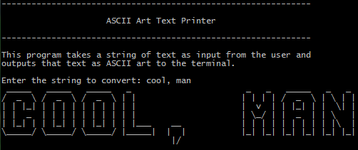
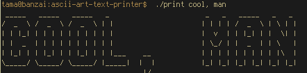

ASCII Art Text Printer
======================

This program takes a string of text from the user and converts it to ASCII Art. At the moment, it only has capital letters, numbers, a comma, space, hyphen, $, and period. The rest of the ASCII set is not implemented (that may be part of a future release). The current working font set is included as [font.txt](font.txt) merely for reference; the program does not pull the glyphs from that file. Also note that I made the font in a hurry, and I know it looks horrible; don't judge.

The program works much like a [dot matrix printer](http://en.wikipedia.org/wiki/Dot_matrix_printing). Each glyph is seven lines tall and eight characters wide (With the exception of the number 8). The program prints the first line of the whole string, prints a line feed, and then prints the second line of the whole string, and it continues in like fashion until all seven lines are printed. As such, if the string is wider than the terminal, the results will be quite ugly.

### Building
To compile simply
```
$ make
```

and to get rid of the executable
```
$ make clean
```

### Running
The makefile compiles to an executable called print, you can
```
$ ./print
```
either with or without arguments.

### Screenshot:



